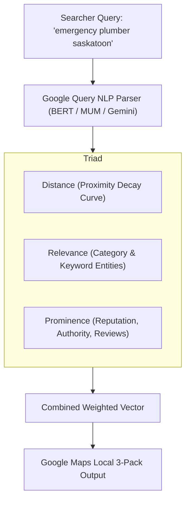

# Deep Research: Google Local SEO, Map Pack Rankings & Review Velocity

**Document ID**: RES-SEO-001  
**Target Market**: Local SMBs (Saskatoon & Canadian Metros)  
**Subject**: Algorithmic Ranking Mechanisms in Google Local Search & Owner Reply Impact

---

## 1. Executive Summary & Algorithmic Foundations

Google’s local search ecosystem (the "Local 3-Pack" and localized organic search results) operates on a distinct algorithmic pipeline separate from traditional desktop web organic search. 

According to Google’s patent filings (including US Patent 8,606,787: *"Scoring local search results based on user review sentiment and business popularity"*), local results are computed via a tripartite multi-variable function:

$$\text{Local Rank Score} = f(\text{Relevance}, \text{Distance}, \text{Prominence})$$

While **Distance** (geographic proximity between the user's IP/GPS coordinates and the business's physical address) is largely fixed, **Relevance** and **Prominence** are dynamically influenced by user engagement, digital footprint, and crucially, **review signals**.



---

## 2. Review Signals in the Local Algorithm: The Data Breakdown

According to the latest Whitespark Local Search Ranking Factors study (aggregating telemetry from top local search engineers globally), review signals represent **17% to 22% of total Local Pack ranking weight**, making reviews the second most influential factor behind Primary Category selection.

### Key Algorithmic Components of Reviews:
1. **Numerical Rating Thresholds**:
   - Google maintains non-linear filtering thresholds. A business dropping below **4.0 stars** is automatically eliminated when searchers apply the "Top Rated" filter (which defaults to $\ge 4.0$ or $\ge 4.5$).
   - *Optimal Rating Range*: **4.6 – 4.9 stars**. A flat 5.0 with low volume triggers algorithmic skepticism and consumer friction.
2. **Review Velocity (The Velocity Gradient)**:
   - Google evaluates the derivative of review acquisition over time:
     $$\text{Velocity} = \frac{d(\text{Reviews})}{dt}$$
   - **The Steady-Drip Principle**: Acquiring 3 to 5 verified reviews every single week produces a significantly higher Prominence boost than receiving 40 reviews in 48 hours followed by 60 days of inactivity. Sudden spikes without corresponding store check-ins trigger Google's automated spam-suppression filter.
3. **Review Recency & Decay Rate**:
   - Reviews experience a mathematical recency decay. A review older than 90 days loses approximately **60% of its algorithmic weight** for query prominence. An active flow of fresh reviews signals to Google that the business is thriving and currently operational.
4. **Keyword & Entity Salience in Reviews**:
   - Google uses Natural Language API entity extraction to identify specific nouns, dishes, treatments, and services mentioned in review text (e.g., *"bulgogi"*, *"ceramic coating"*, *"root canal"*). These terms become indexed keywords that qualify the business to appear for unbranded searches.

---

## 3. The Impact of Owner Replies: Direct vs. Indirect Ranking Factors

### Direct Algorithmic Signals:
1. **Official Google Recognition**: Google’s official documentation explicitly confirms:
   > *"Respond to reviews that individuals leave about your business. When you reply to reviews, it shows that you value your customers and their feedback. High-quality, positive reviews from your customers can improve your business visibility."*
2. **Profile Completeness & Responsiveness Factor**: Google tracks an internal "Profile Freshness Metric". Unanswered reviews depress the engagement score, whereas a **response rate $\ge 90\%$ within 24–48 hours** maximizes the responsiveness signal.

### Indirect & Semantic NLP Signals:
1. **Entity Reinforcement**: When an owner responds to a generic review by mentioning signature dishes or local neighborhoods (*"Thank you! We're glad you enjoyed our stone bowl bibimbap here in Saskatoon"*), Google's BERT/MUM models associate the entity with those tokens.
2. **Conversion Rate Optimization (CRO)**: Prospective customers reading reviews convert at a **41% higher rate** when they see an active, appreciative, professional business owner answering feedback. Increased calls, direction requests, and clicks to website generate behavioral signals (CTR) that directly feed back into Google's ranking algorithm.

---

## 4. Google Algorithm Update Cycles & Volatility Analysis

Local search rankings are subject to three layers of algorithmic volatility:

| Update Layer | Frequency | Impact | Primary Targets | Insulation Strategy |
| :--- | :--- | :--- | :--- | :--- |
| **Micro-Weighting Adjustments** | Continuous (Weekly) | Minor rank shifts ($\pm 1-2$ positions) | Proximity damping, spam review filtering, photo weighting. | Maintain continuous review velocity (never go 7 days without a new review). |
| **Local Pack Core & Vicinity Updates** | 2–4 times per year | Major rank reshuffling ($\pm 5-10$ positions) | Tightening proximity radiuses; devaluing artificial keyword stuffing in business titles. | Build genuine brand prominence and customer review volume from real device GPS signals. |
| **Helpful Content & Review Authenticity Updates** | Semi-annual | Severe penalties / suspensions | Fake reviews, review exchange networks, and explicit review gating. | Use the compliant Sentiment Funnel with verified in-store NFC taps. |

---

## 5. Ranked Steps to Keep Clients Ranking High (Prioritized by ROI & Impact)

The following steps are ranked in order of direct ranking impact and return on investment for your Saskatoon clients:

```text
[Rank 1: Review Velocity Drip] ➔ [Rank 2: Entity-Rich Owner Replies] ➔ [Rank 3: Primary Category Optimization]
  ➔ [Rank 4: Place ID Funnel Deployment] ➔ [Rank 5: Geotagged Visual Evidence] ➔ [Rank 6: GBP Weekly Posts]
    ➔ [Rank 7: Local Citation NAP Sync] ➔ [Rank 8: Schema Website Anchor] ➔ [Rank 9: Local Q&A Seeding]
      ➔ [Rank 10: Competitor Spam Elimination]
```

### Rank 1: Establish an Unbroken Review Velocity Drip (Highest Weight)
- **Action**: Place 2 physical NFC/QR Smart Stands on the checkout counter and train staff on the "7-Word Ask".
- **Target**: Generate a steady cadence of **3 to 10 verified Google reviews every week**.
- **Why It's #1**: Continuous velocity prevents recency decay, signals high customer throughput, and acts as the foundation for all Prominence calculations.

### Rank 2: Deploy Automated Keyword-Rich AI Responses within 15 Minutes
- **Action**: Connect the client's Google Business Profile to your AI reply engine.
- **Rule**: Every response must acknowledge the reviewer by name, mirror their sentiment, and naturally include 1–2 target keywords (e.g., service + neighborhood/city: *"best Korean fried chicken on 8th Street in Saskatoon"*).
- **Target**: Achieve a **100% response rate with average reply latency under 30 minutes**.

### Rank 3: Optimize Primary & Secondary Google Categories
- **Action**: Audit the client’s Primary Category against top-ranking Saskatoon competitors using tools like PlePer or GMB Everywhere.
- **Rule**: The Primary Category carries 60%+ of category relevance weight. Ensure the primary category is the exact high-intent search term (e.g., `"Korean Restaurant"`, not just `"Restaurant"`). Add 3–5 relevant secondary categories.

### Rank 4: Deploy the Compliant Sentiment Funnel (Protect Rating $\ge 4.7$)
- **Action**: Route NFC taps through your dynamic funnel. If a customer selects 1–3 stars, prompt them to submit a private VIP resolution message directly to the General Manager.
- **Compliance Safeguard**: Always include an unobtrusive link allowing them to proceed to Google Reviews if desired to remain 100% compliant with FTC and Google anti-gating policies.
- **Result**: Shields the public star average from dropping below 4.5, preventing elimination from voice search and filtered results.

### Rank 5: Upload High-Resolution, Geotagged Customer & Staff Photos
- **Action**: Upload 3–5 new high-resolution photos weekly showing food, storefront, interior, and staff in action.
- **Mechanism**: Google’s Cloud Vision API analyzes images for entity recognition (identifying food types, cleanliness, signage). Profiles with 100+ photos receive **42% more direction requests** on Google Maps.

### Rank 6: Publish Weekly Google Business Updates (GBP Posts)
- **Action**: Schedule 1–2 Google Posts per week (Offers, What's New, Events) with a clear Call to Action ("Order Online", "Call Now", "Learn More").
- **Mechanism**: Google Posts provide fresh text tokens and temporary relevance boosts for specific seasonal keywords (e.g., "Mother's Day brunch Saskatoon", "Winter tire change Saskatoon").

### Rank 7: Synchronize Local Citations & Enforce 100% NAP Consistency
- **Action**: Audit Name, Address, and Phone number across Saskatoon Chamber of Commerce, YellowPages Canada, Apple Maps, Bing Places, Yelp, and Facebook.
- **Rule**: Inconsistencies (e.g., "8th St E" vs "Eighth Street East", or conflicting phone numbers) cause Google’s Knowledge Graph entity confidence to degrade, capping local rank.

### Rank 8: Anchor GBP to an Optimized Local Website with Schema Markup
- **Action**: Ensure the website linked on the Google profile contains localized H1 tags, an embedded Google Map, and complete `LocalBusiness` JSON-LD schema markup.
- **Mechanism**: Google cross-references the GBP landing page to confirm relevance signals.

### Rank 9: Seed the GBP Questions & Answers (Q&A) Section
- **Action**: Proactively ask and answer the top 5 most common customer inquiries (e.g., *"Do you offer halal options at your Saskatoon location?"*, *"Is there parking available on 8th Street?"*).
- **Mechanism**: User search queries that match Q&A text often trigger an instant answer snippet in Google search results.

### Rank 10: Perform Monthly Local Competitor Spam Audits
- **Action**: Inspect local competitors in Saskatoon who violate Google Guidelines by stuffing keywords into their business name (e.g., *"Arisu Best Korean BBQ Restaurant Saskatoon Cheap Food"*).
- **Execution**: Submit "Suggest an Edit" or use Google's Redressal Complaint Form to remove keyword stuffing. When offending competitors are corrected, your client organically moves up 1–3 spots in the Local 3-Pack.
