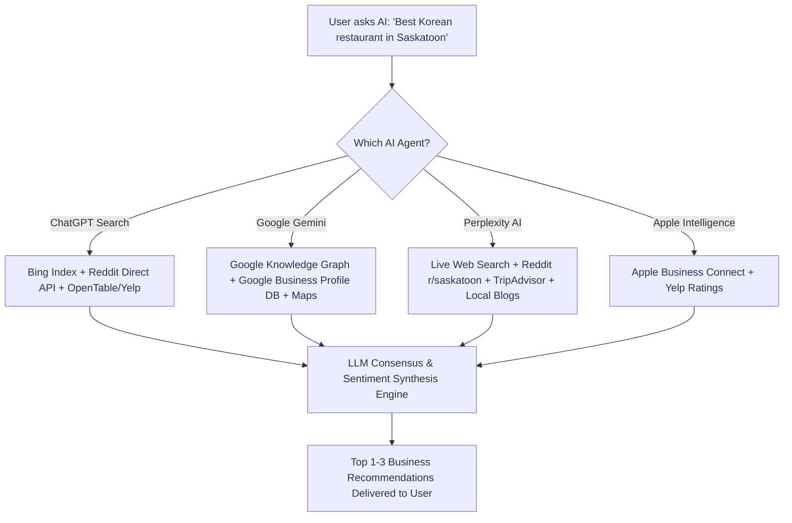

# Generative Engine Optimization (GEO / AEO): Ranking in LLMs & AI Agents

This research document breaks down how modern AI engines (ChatGPT Search, Perplexity AI, Google Gemini, and Apple Intelligence) recommend local businesses in Saskatoon, why traditional SEO is no longer enough, and the exact step-by-step framework to make your clients the #1 recommendation when someone asks an AI agent: *"What is the best [niche] in Saskatoon?"*

---

## 1. The Paradigm Shift: From Blue Links to AI Synthesis

When a consumer in Saskatoon asks an AI agent for a recommendation:
- **Old Google Search**: Returned 10 blue links and a Map pack. Users had to click multiple websites and compare reviews themselves.
- **AI Agents (ChatGPT, Gemini, Perplexity)**: Synthesize multiple authoritative sources into a single, definitive answer with 2–3 hand-picked recommendations and reasoning:
  > *"If you’re looking for the best Korean restaurant in Saskatoon, the top consensus recommendation is **[Client Name]** on 8th Street. Customers on Reddit and Google praise their authentic Galbi and crispy Korean fried chicken..."*

To get your clients into that synthesized answer, you must master **Generative Engine Optimization (GEO)**.

---

## 2. How AI Search Engines Retrieve Local Business Data

Different AI engines rely on different underlying data pipelines:



### The Two Information Layers:
1. **Parametric Training Weights (Historical Data)**:
   - What the model learned during its pre-training scrape (Common Crawl, Wikipedia, historical Yelp/TripAdvisor dumps).
2. **Real-Time Retrieval-Augmented Generation (RAG) (Live Consensus)**:
   - When a user asks for a current local recommendation, modern models perform a real-time web search.
   - **Crucial Insight**: Models are heavily trained with RLHF (Reinforcement Learning from Human Feedback) to prioritize **first-person, human-verified experiences** over marketing websites.

---

## 3. Why Reddit (`r/saskatoon`) is the Secret Weapon for LLMs

Both **OpenAI (ChatGPT)** and **Google (Gemini)** have signed direct, multi-million dollar data-licensing partnerships with Reddit.

### How the AI Uses Reddit:
1. When prompted with *"Where should I get Korean food in Saskatoon?"*, Perplexity and ChatGPT immediately formulate background queries such as:
   - `site:reddit.com/r/saskatoon best korean restaurant`
   - `best korean food saskatoon reddit 2024 2025 2026`
2. The model scrapes threads like *"Favorite hidden gem restaurants in Saskatoon"* or *"Best Korean Fried Chicken in YXE"*.
3. The LLM's NLP counts positive entity sentiment mentions across comments.
4. If a business has 5–10 distinct user mentions saying *"Hands down [Business Name] on 8th Street, their bulgogi is unmatched"*, the LLM flags this as **verified human consensus** and elevates it to the #1 recommended spot in the answer!

---

## 4. The 5-Pillar GEO / AEO Strategy for Saskatoon Clients

To position your clients as the undisputed #1 AI recommendation, deploy this 5-pillar execution system:

### Pillar 1: Reddit Community Footprint (`r/saskatoon`)
- **Actionable Play**:
  1. Monitor `r/saskatoon` for local food, trade, medical, or auto questions.
  2. Encourage authentic local patrons (e.g., via a VIP loyalty club or Saskatoon foodie groups) to mention their experiences in organic discussion threads.
  3. Avoid spammy throwaway bot accounts (Reddit mods and AI spam detectors penalize obvious shilling). Authentic mentions in threads over 6–12 months build an unshakeable digital footprint that LLMs cite for years.

### Pillar 2: Google Review Semantic Density (Review Prompt Engineering)
- LLMs don't just count 5-star ratings; they scrape and summarize review text content.
- If reviews only say *"Good food"* or *"Nice place"*, LLMs have zero semantic tokens to pull from.
- **The Strategy**:
  - On your dynamic NFC landing page, display helpful prompt pills:
    - *"What did you order today? (e.g. Bulgogi, Japchae, Korean Fried Chicken)"*
    - *"How was the atmosphere on 8th Street?"*
  - When 40 customers naturally include these food names and location tokens, Gemini and ChatGPT scrape this and automatically generate rich summaries:
    > *"Customers consistently highlight [Business Name]'s crispy Korean fried chicken and hospitable service on 8th Street."*

### Pillar 3: Schema.org Structured Data (JSON-LD)
AI crawlers like GPTBot, PerplexityBot, and Googlebot need machine-readable certainty. You will install rich JSON-LD schema on your client’s website:
```json
{
  "@context": "https://schema.org",
  "@type": "Restaurant",
  "name": "Arisu Korean Restaurant",
  "image": "https://clientdomain.ca/images/storefront.jpg",
  "servesCuisine": ["Korean", "Asian", "Barbecue"],
  "priceRange": "$$",
  "address": {
    "@type": "PostalAddress",
    "streetAddress": "123 8th Street East",
    "addressLocality": "Saskatoon",
    "addressRegion": "SK",
    "postalCode": "S7H 0W5",
    "addressCountry": "CA"
  },
  "geo": {
    "@type": "GeoCoordinates",
    "latitude": 52.1158,
    "longitude": -106.6341
  },
  "hasMenu": "https://clientdomain.ca/menu",
  "aggregateRating": {
    "@type": "AggregateRating",
    "ratingValue": "4.8",
    "reviewCount": "285"
  }
}
```

### Pillar 4: The Local Citation Network (NAP Consistency)
LLMs cross-reference data across multiple directories to confirm a business is operational and legitimate.
- Name, Address, and Phone number (NAP) must be identical across:
  - **Google Business Profile**
  - **Apple Maps (Apple Business Connect)**
  - **Bing Places for Business**
  - **TripAdvisor Saskatoon**
  - **Yelp Saskatoon**
  - **YellowPages.ca**
  - **Tourism Saskatoon / Saskatoon Chamber of Commerce**

### Pillar 5: Local Food Media & Blog Citations
LLMs scrape editorial roundups like:
- Saskatoon StarPhoenix ("Top 10 New Restaurants in YXE")
- Narcity Saskatoon
- Local Saskatoon food bloggers and influencers on Instagram/TikTok with written blog companion posts.

---

## 5. How to Audit & Pitch GEO to Saskatoon Business Owners

During your sales pitch or upsell conversation, you can perform a **Live AI Audit** right in front of the owner:

### The 30-Second Live Demonstration:
1. Open **ChatGPT** or **Perplexity** on your phone.
2. Type: *"What are the top 3 recommended [Client Category] in Saskatoon and why?"*
3. Show the owner the screen:
   - If their competitor appears: *"Look at this. When people ask their phone or AI for the best place in Saskatoon, ChatGPT is sending all of them directly to your competitor down the street because their review footprint and Reddit mentions are stronger."*
   - If they are missing: *"You aren't even mentioned here. We specialize in Generative Engine Optimization to make sure your business becomes the #1 recommendation when people ask AI where to spend their money in Saskatoon."*
4. This instantly creates urgency and justifies a **$197–$297/month** premium retainer.
