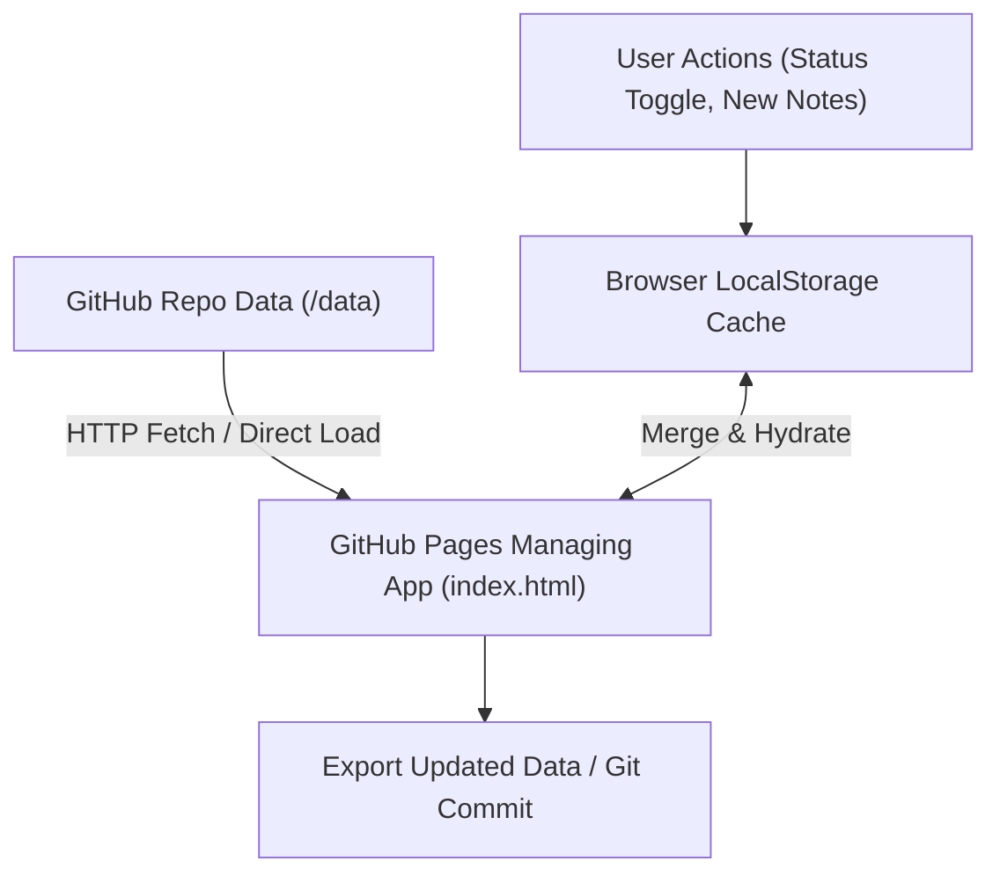

# Data Storage Specification: Git-Backed Local Lead & Telemetry Store

**Document Version**: 1.1.0  
**Storage Engine**: Git Repository JSON Storage (`/data`) with Browser LocalStorage Synchronization  
**Target Market**: Saskatoon, Saskatchewan, Canada  

---

## 1. Architectural Overview

To eliminate mockup figures and ensure the Command Center and CRM reflect real Saskatoon market data, the platform uses a transparent **Git-backed JSON Data Engine**.



### Storage Principles:
1. **Source of Truth**: The `/data` directory in the repository holds the verified dataset of Saskatoon SMB leads and baseline metrics.
2. **Offline & Edge Capability**: The web app loads repository data into memory, blends it with any updates stored in the user's `localStorage`, ensuring updates persist across page reloads without requiring an external database.
3. **Auditability**: Every change to lead lists, client statuses, or review counts can be tracked via standard Git commits.

---

## 2. Data File Specifications

### 2.1 `data/saskatoon_leads_tier1.json` (High-Ticket / High-Trust)
Contains verified local businesses in Saskatoon with high average transaction values ($300 – $3,500+):
- **Target Sectors**: Cosmetic Dental Clinics, Orthodontists, Medical Aesthetics / Laser Spas, Auto Detailing & Collision Centers, Mechanics, Home Service Trades (HVAC, Plumbing, Roofing).
- **Minimum Target Volume**: $\ge 100$ leads.

#### JSON Schema:
```json
{
  "$schema": "http://json-schema.org/draft-07/schema#",
  "type": "array",
  "items": {
    "type": "object",
    "required": ["id", "name", "zone", "address", "category", "est_rating", "review_count", "avg_ticket", "phone", "pain_point", "status"],
    "properties": {
      "id": { "type": "string" },
      "name": { "type": "string" },
      "zone": { "type": "string" },
      "address": { "type": "string" },
      "category": { "type": "string" },
      "est_rating": { "type": "number" },
      "review_count": { "type": "integer" },
      "avg_ticket": { "type": "string" },
      "phone": { "type": "string" },
      "pain_point": { "type": "string" },
      "status": { 
        "type": "string",
        "enum": ["Not Contacted", "14-Day Drop Placed", "Closed Paid Retainer", "Follow Up Required"]
      },
      "place_id": { "type": "string" },
      "website": { "type": "string" }
    }
  }
}
```

---

### 2.2 `data/saskatoon_leads_tier2.json` (High-Traffic / High-Frequency)
Contains verified local businesses in Saskatoon with high customer transaction frequency ($15 – $80 average bill):
- **Target Sectors**: Ethnic Dining (Korean, Vietnamese, Japanese, Indian), Specialty Cafes & Artisan Bakeries, Barbershops, Hair Salons, Boutique Gyms / Fitness Studios.
- **Minimum Target Volume**: $\ge 100$ leads.

---

### 2.3 `data/metrics.json` (Aggregate Market Telemetry)
Stores computed market statistics derived directly from the real Saskatoon datasets:
```json
{
  "market": "Saskatoon, SK",
  "last_updated": "2026-09-10",
  "tier1_total_leads": 105,
  "tier2_total_leads": 108,
  "total_tracked_leads": 213,
  "avg_saskatoon_review_count": 84,
  "avg_saskatoon_star_rating": 4.52,
  "market_opportunity_mrr_cad": 31737,
  "corridor_distribution": {
    "8th_street_east": 54,
    "broadway_avenue": 36,
    "downtown_core": 48,
    "riversdale_20th_st": 28,
    "north_industrial_51st": 47
  }
}
```

---

## 3. Data Ingestion & State Synchronization Protocol

1. **Initial Hydration**:
   - On page load, `index.html` initializes the dataset from the bundled/embedded `/data/*.json` stores.
   - It checks `localStorage.getItem('yxe_leads_v2')`. If local user modifications exist (e.g., status changed from "Not Contacted" to "14-Day Drop Placed"), it merges the changes seamlessly.
2. **Real Number Computation in Command Center**:
   - The Command Center KPI cards (Total Market Leads, Total Taps, Shielded Complaints, Projected Retainer Value) are calculated mathematically from the active lead array—**never hardcoded or faked**.
3. **Data Export**:
   - The platform includes a 1-click **"Export Updated Leads JSON"** button allowing the user to download modified CRM states and commit them back to the GitHub repository anytime.
