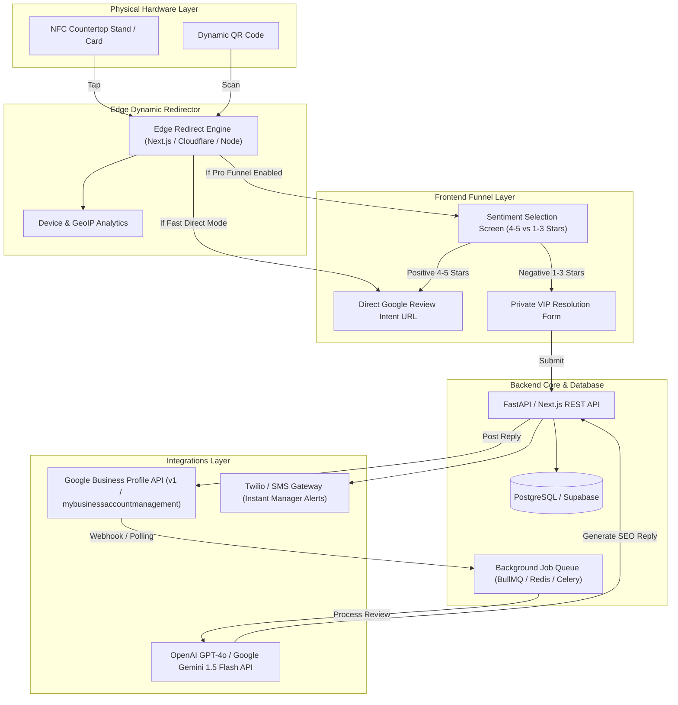

# Platform Specification: Local Business Reputation & AI SEO Engine

**Document Version**: 1.0.0  
**Target Market**: Local SMBs (Saskatoon, Canada & Beyond)  
**System Name**: *RepuFlow AI / TapReview Engine*

---

## 1. Executive Summary & Product Goals

The platform is a multi-tenant B2B SaaS designed to bridge physical NFC/QR interactions with automated Google Business Profile (GBP) reputation management, Local SEO optimization, and Generative Engine Optimization (GEO).

### Primary Goals:
1. **Dynamic Smart Redirection**: Provide ultra-fast (<50ms) dynamic URL resolution for physical NFC cards and QR codes with device tracking and location attribution.
2. **Compliant Sentiment Funnel**: Maximize public 5-star Google reviews while intercepting dissatisfied customers (1–3 stars) via a private, instant-resolution manager intake form (100% compliant with FTC and Google anti-gating policies).
3. **Automated AI Review Responder**: Ingest all incoming and historical Google Reviews via the official Google Business Profile API, generating keyword-rich, personalized responses with human-in-the-loop or full-autopilot modes.
4. **Local SEO & Entity Injection**: Systematically weave local geography keywords (e.g., "Saskatoon", "8th Street") and high-margin service terms into review replies to elevate Google Local Pack rankings.
5. **GEO / LLM Presence Audit**: Track client citations and sentiment across Reddit (`r/saskatoon`), Google Knowledge Graph, and LLM search agents.

---

## 2. System Architecture



---

## 3. Core Functional Modules & Specifications

### Module 1: Dynamic Redirector & Sentiment Funnel
- **Dynamic Endpoint**: `GET /r/:tagSlug`
- **Latency Target**: $<50\text{ ms}$ response time.
- **Routing Logic**:
  1. Lookup `tagSlug` in database or Redis edge cache.
  2. If client is on **Starter Tier (Direct)**: Return immediate `302 Found` to `location.google_review_url`.
  3. If client is on **Pro Tier (Sentiment Funnel Enabled)**: Render the lightweight mobile-first Sentiment Funnel:
     - Header: Business Logo + Business Name.
     - Headline: *"How was your experience today at [Business Name]?"*
     - Rating Selector: 5 interactive stars or Thumbs Up / Thumbs Down.
     - **If 4 or 5 Stars**: Immediately redirects to the Google Review form with optional keyword inspiration pills (e.g. "Great Service", "Crispy Chicken", "Friendly Staff").
     - **If 1, 2, or 3 Stars**: Opens an empathetic resolution screen:
       > *"We are so sorry your visit wasn't 5-star perfect. Our General Manager wants to make this right immediately. Please share what happened below:"*
       - Input fields: Name, Phone/Email, Message.
       - Direct SMS/Email notification dispatched to the owner's phone within 30 seconds.
       - *Compliance safety*: Includes a subtle text link: *"Prefer to leave public feedback? Continue to Google"*, satisfying Google & FTC non-deceptive review guidelines.

---

### Module 2: Google Business Profile (GBP) API Integration
- **Authentication**: Google OAuth 2.0 with scopes:
  - `https://www.googleapis.com/auth/business.manage`
- **Sync Engine**:
  - Ingests past 100 historical reviews on account connection.
  - Webhook listener via Google Cloud Pub/Sub (`mybusinessbusinessinformation.googleapis.com`) or recurring cron sync (every 15 minutes) for new reviews.
- **Review Reply Mutation**:
  - Endpoint: `PATCH https://mybusiness.googleapis.com/v4/{name=accounts/*/locations/*/reviews/*}/reply`
  - Body: `{ "comment": "..." }`

---

### Module 3: AI Auto-Reply Engine with SEO Keyword Injection
- **Engine Capabilities**:
  - Multi-LLM provider support (Google Gemini Flash & OpenAI GPT-4o-mini).
  - Sentiment classification: Positive, Neutral, Negative, Escalated.
  - **Tone Presets**: Professional, Friendly/Warm, Casual/Trendy, Luxury/Upscale.
  - **Local SEO & Entity Injection Matrix**:
    - Each business profile stores a list of targeted keywords:
      - Primary Service (e.g., "Korean BBQ", "Ceramic Coating", "Invisalign")
      - Geographic Anchor (e.g., "Saskatoon", "8th Street East", "Broadway")
      - Signature Offering (e.g., "Stone Bowl Bibimbap", "Emergency Plumbing")
    - The LLM prompt dynamically constrains responses to include 1–2 relevant keywords naturally without robotic keyword stuffing.
  - **Approval Modes**:
    - *Full Autopilot*: Auto-publishes reply within 15 minutes of review posting.
    - *Human-in-the-Loop (Recommended for Negative Reviews)*: Generates draft, sends SMS/WhatsApp to owner: *"New 2-star review from Dave. Click to approve draft reply or edit."*

---

### Module 4: Analytics & Business Intelligence Dashboard
- **Tag Metrics**: Total taps, unique devices, peak hours (e.g., Friday 7–9 PM), NFC vs QR scan ratio.
- **Review Velocity Graph**: New reviews per week/month benchmarked against top 3 Saskatoon competitors.
- **Sentiment Breakdown**: Star distribution, intercepted negative feedback count, resolution rate.

---

## 4. Database Schema (PostgreSQL / Supabase DDL)

```sql
-- 1. Organizations (Agency Clients)
CREATE TABLE organizations (
    id UUID PRIMARY KEY DEFAULT gen_random_uuid(),
    name VARCHAR(255) NOT NULL,
    slug VARCHAR(100) UNIQUE NOT NULL,
    plan_tier VARCHAR(50) DEFAULT 'pro', -- 'starter', 'pro', 'enterprise'
    created_at TIMESTAMP WITH TIME ZONE DEFAULT NOW(),
    updated_at TIMESTAMP WITH TIME ZONE DEFAULT NOW()
);

-- 2. Business Locations (Google Business Profiles)
CREATE TABLE locations (
    id UUID PRIMARY KEY DEFAULT gen_random_uuid(),
    organization_id UUID REFERENCES organizations(id) ON DELETE CASCADE,
    name VARCHAR(255) NOT NULL,
    google_place_id VARCHAR(255),
    google_account_id VARCHAR(255),
    google_location_id VARCHAR(255),
    google_review_url TEXT NOT NULL,
    funnel_enabled BOOLEAN DEFAULT TRUE,
    auto_reply_enabled BOOLEAN DEFAULT TRUE,
    reply_approval_mode VARCHAR(50) DEFAULT 'auto_positive_manual_negative', -- 'full_auto', 'manual', 'auto_positive'
    brand_tone VARCHAR(50) DEFAULT 'warm_friendly',
    seo_keywords TEXT[] DEFAULT ARRAY['Saskatoon'],
    manager_alert_phone VARCHAR(50),
    manager_alert_email VARCHAR(255),
    created_at TIMESTAMP WITH TIME ZONE DEFAULT NOW()
);

-- 3. Physical NFC Tags & QR Code Displays
CREATE TABLE nfc_tags (
    id UUID PRIMARY KEY DEFAULT gen_random_uuid(),
    location_id UUID REFERENCES locations(id) ON DELETE CASCADE,
    tag_slug VARCHAR(100) UNIQUE NOT NULL, -- e.g. 'yxe-korean-counter-1'
    label VARCHAR(255) NOT NULL, -- e.g. 'Main Counter Acrylic Stand'
    placement_type VARCHAR(50) DEFAULT 'countertop', -- 'countertop', 'pocket_card', 'table_puck'
    total_taps INTEGER DEFAULT 0,
    created_at TIMESTAMP WITH TIME ZONE DEFAULT NOW()
);

-- 4. Tap & Scan Analytics
CREATE TABLE tap_events (
    id UUID PRIMARY KEY DEFAULT gen_random_uuid(),
    nfc_tag_id UUID REFERENCES nfc_tags(id) ON DELETE CASCADE,
    user_agent TEXT,
    device_type VARCHAR(50), -- 'ios', 'android', 'desktop'
    interaction_type VARCHAR(20) DEFAULT 'nfc', -- 'nfc' or 'qr'
    ip_hash VARCHAR(64),
    created_at TIMESTAMP WITH TIME ZONE DEFAULT NOW()
);

-- 5. Intercepted Private Customer Feedback (Negative Reviews Shielded)
CREATE TABLE private_feedbacks (
    id UUID PRIMARY KEY DEFAULT gen_random_uuid(),
    location_id UUID REFERENCES locations(id) ON DELETE CASCADE,
    customer_name VARCHAR(255),
    customer_contact VARCHAR(255),
    rating_selected INTEGER NOT NULL, -- 1, 2, or 3
    message TEXT NOT NULL,
    status VARCHAR(50) DEFAULT 'new', -- 'new', 'contacted', 'resolved'
    created_at TIMESTAMP WITH TIME ZONE DEFAULT NOW()
);

-- 6. Google Reviews Ingestion & AI Replies
CREATE TABLE google_reviews (
    id UUID PRIMARY KEY DEFAULT gen_random_uuid(),
    location_id UUID REFERENCES locations(id) ON DELETE CASCADE,
    google_review_id VARCHAR(255) UNIQUE NOT NULL,
    reviewer_name VARCHAR(255),
    star_rating INTEGER NOT NULL,
    comment TEXT,
    review_timestamp TIMESTAMP WITH TIME ZONE,
    reply_status VARCHAR(50) DEFAULT 'pending', -- 'pending', 'drafted', 'published', 'ignored'
    drafted_reply TEXT,
    published_reply TEXT,
    published_at TIMESTAMP WITH TIME ZONE,
    created_at TIMESTAMP WITH TIME ZONE DEFAULT NOW()
);
```

---

## 5. Security, Privacy & Platform Compliance

1. **FTC & Google Compliance**: The system never deceives the customer or falsifies credentials. The private feedback form provides an immediate remedy pathway while still offering a transparent path to Google Reviews, preserving platform integrity.
2. **OAuth Token Security**: Google Refresh Tokens and Access Tokens are encrypted at rest using AES-256-GCM.
3. **Rate Limiting**: Edge dynamic redirect endpoints are protected with IP-based rate limiting (10 requests/min per IP) to prevent malicious click flooding.
